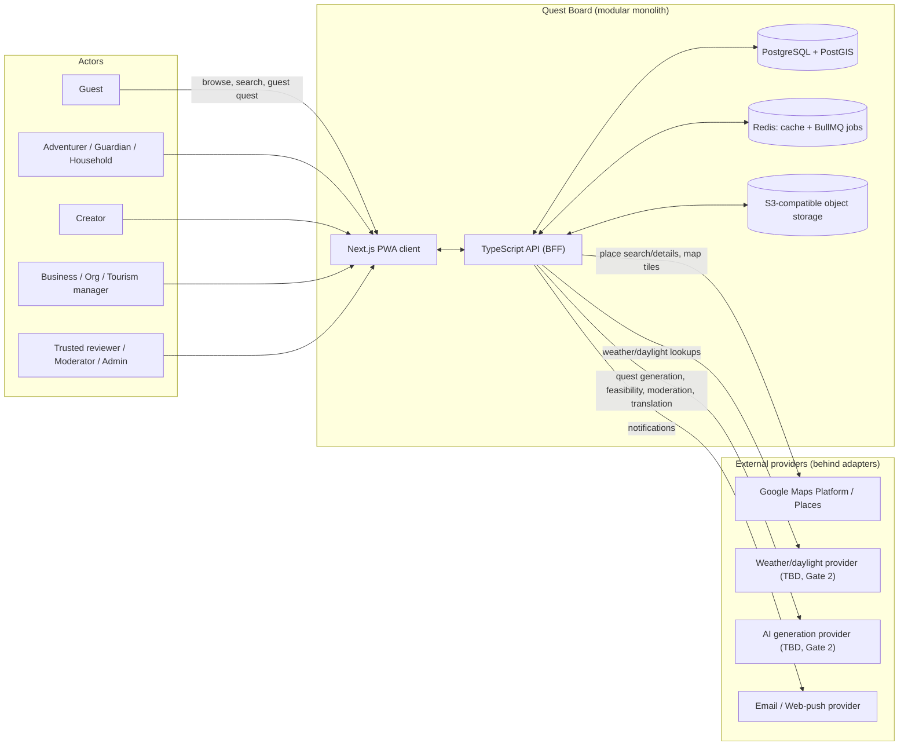
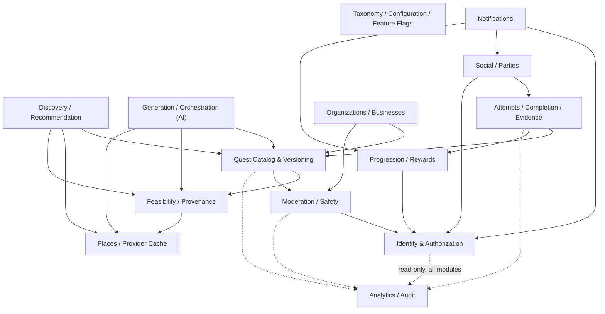

# Gate 1 — System Context and Module Diagrams

## System context

No payment provider appears here — Release 1/1.1 has no monetization surface
(Gate 0 decision log DL-004, DL-012). It's added at the Release 2 gate when
Section 33's monetization is actually designed.

## Module boundaries (internal to the API service)

Directly from Section 36's architectural-boundaries list. Arrows show the
*allowed* call direction; a module may only call another through its
published interface, never its internals (ADR-001).

Notes:

- **Identity & Authorization** and **Taxonomy/Config/Feature Flags** are
  depended on by nearly everything and depend on nothing else — they're the
  foundation modules built at Gate 2.
- **Analytics/Audit** only ever receives events (dotted arrows) — it never
  calls back into another module, which keeps audit logging from becoming a
  hidden coupling point.
- **Places/Provider Cache** is the only module allowed to call the Google
  adapter (ADR-005); Discovery, Generation, and Feasibility consume it, they
  never call Google directly.
- **Generation/Orchestration** (the AI layer, ADR-006) depends on Catalog
  (to write structured drafts), Feasibility (to gate what it's allowed to
  suggest as confirmed), and Places/Provider Cache (as factual grounding
  context) — it never calls Attempts, Progression, or Social directly, which
  keeps the "AI cannot grant rewards or publish socially" boundary structural
  rather than just a code-review rule.
- **Moderation/Safety** can act on Catalog (suspend a quest) and Orgs
  (suspend a business claim) but Catalog/Orgs cannot bypass it — publish-state
  transitions always route through Moderation's authorization check.

## Vertical slice mapping (Gates 2-7 → modules touched)

| Gate | Slice | Primary modules |
|---|---|---|
| 2 | Foundation | Identity, Taxonomy/Config, Analytics/Audit (skeleton) |
| 3 | Discovery vertical slice | Discovery, Places/Provider Cache, Catalog (read path) |
| 4 | Forge and feasibility | Generation, Feasibility, Catalog (write path), Moderation (submission) |
| 5 | Attempts and Hearth | Attempts, Progression, Catalog (Hearth quests) |
| 6 | Community safety | Social, Moderation (full), Orgs (claims foundation), Identity (privacy export/erase) |
| 7 | Exploration and hardening | Discovery (fog), Analytics (readiness scoring), cross-cutting security/perf |

This gives each gate a bounded, reviewable set of modules rather than
touching the whole system every milestone, consistent with Section 47's
"one vertical, testable milestone at a time."
