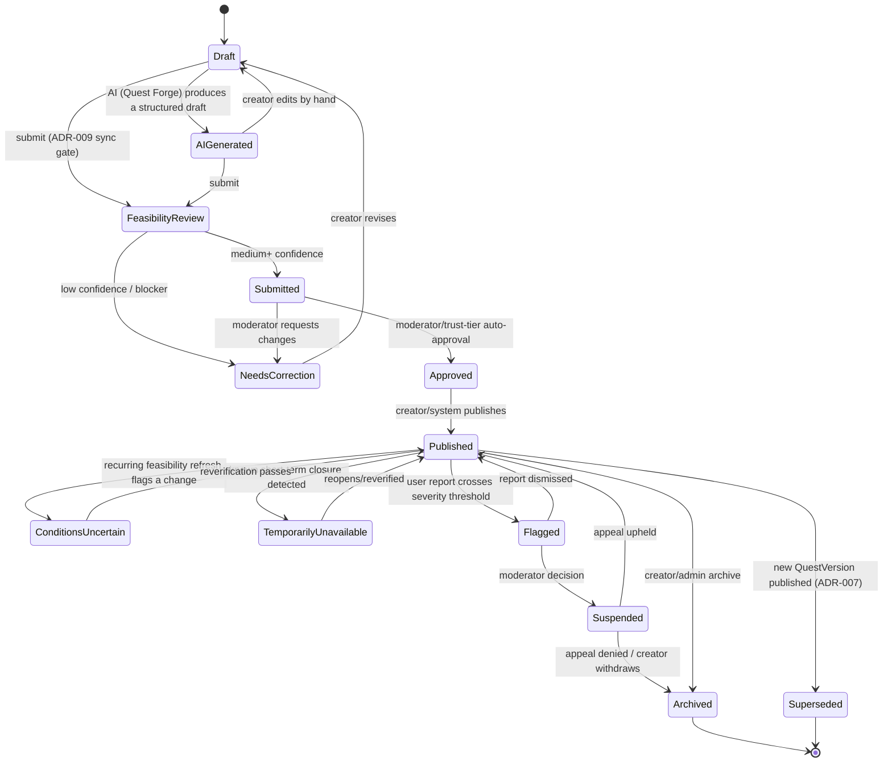
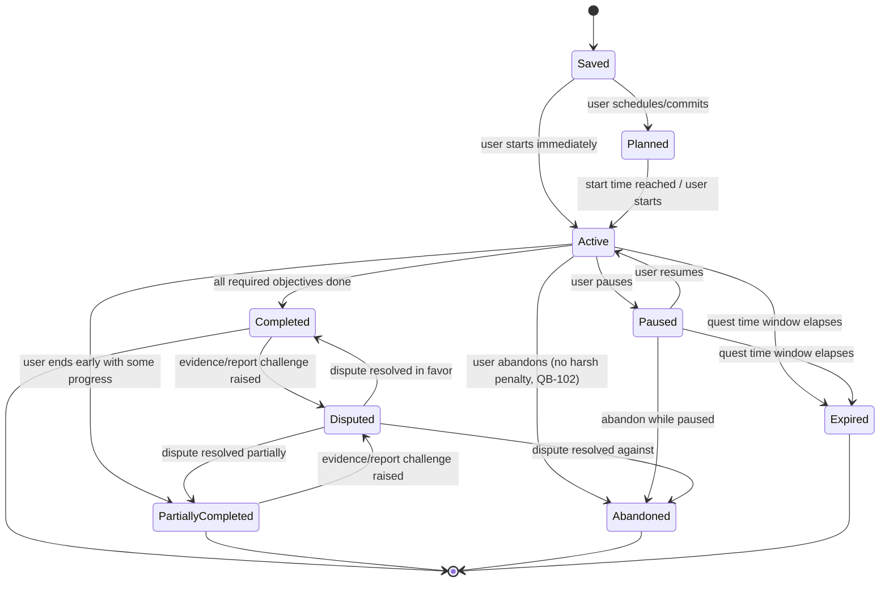

# Gate 1 — Quest and Attempt State Machines

Per QB-163/164/165: every transition below carries an authorization rule
(`05-role-permission-matrix.md`), a timestamp, an actor ID, a reason code
where applicable, and writes an `AuditEvent`.

## Quest publication state machine

Notes:

- **`AIGenerated` is a distinct state from `Draft`** specifically to satisfy
  C-3's resolution (`docs/gate-0/02-contradictions-and-assumptions.md`): it
  marks content that hasn't had a human editing pass yet, which matters for
  moderation prioritization even though both states are equally private/
  unpublished.
- **`FeasibilityReview` is not user-visible as a lingering state** — it's the
  synchronous gate from ADR-009; the `202`/job-id pattern in
  `04-api-contracts.md` means a submitter sees `Submitted` or
  `NeedsCorrection` shortly after, not stuck "in review" indefinitely.
- **Every arrow out of `Published`** other than creator-initiated archive is
  triggered by the recurring feasibility job or the moderation pipeline —
  never by a plain content edit, which instead creates a new `QuestVersion`
  (`Superseded`, ADR-007).
- **New-creator trust gating (QB-162):** for a non-trusted creator, the
  `Submitted → Approved` edge additionally requires a human moderator
  decision rather than auto-approval; this is a policy check inside that
  transition's authorization rule, not a separate state, to avoid an
  explosion of near-duplicate states.

## Attempt state machine

Notes:

- **`Abandoned` and `Expired` are both terminal-but-forgiving states**: per
  QB-102, reaching either grants any partial XP the quest rules allow and
  permits a retry attempt to be started fresh — retrying creates a *new*
  `QuestAttempt`, it never reopens a terminal one.
- **`Disputed` can only be entered from a completed-ish state**, not from
  `Active`/`Paused` — an in-progress attempt has nothing to dispute yet; a
  safety report about an in-progress attempt instead goes through the
  `SafetyIncident` path (Section 25) independent of attempt state.
- **Idempotency (ADR-011):** the `Active → Completed` transition is the one
  most likely to be retried by a flaky client (Section 30's offline sync
  requirement) — its handler is keyed by `Idempotency-Key` so a duplicate
  "complete" submission after a dropped connection never double-grants XP.
