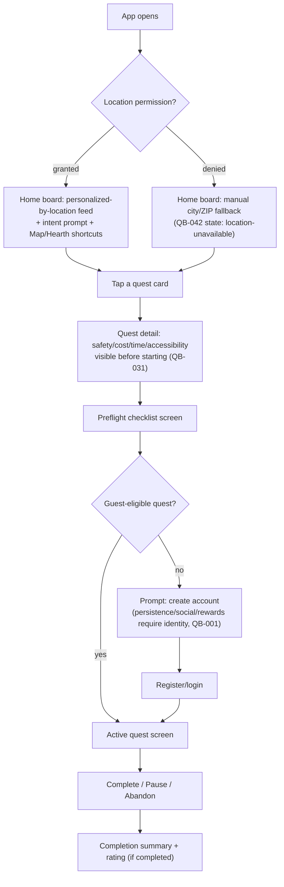
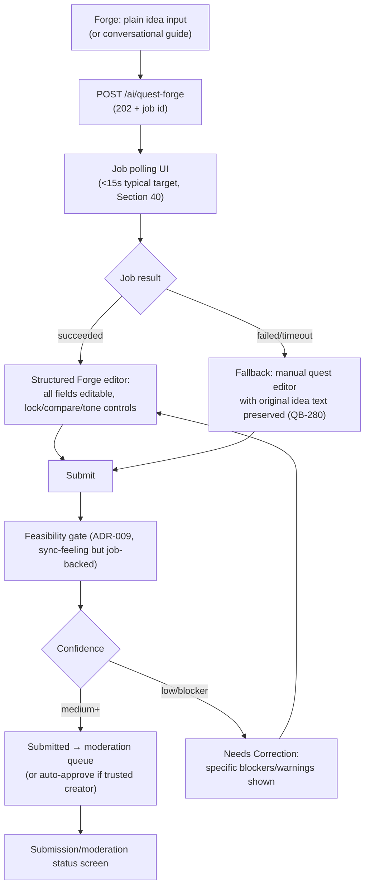
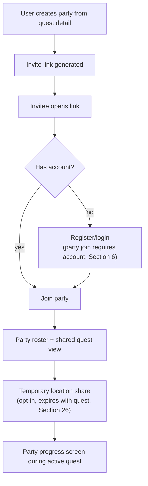
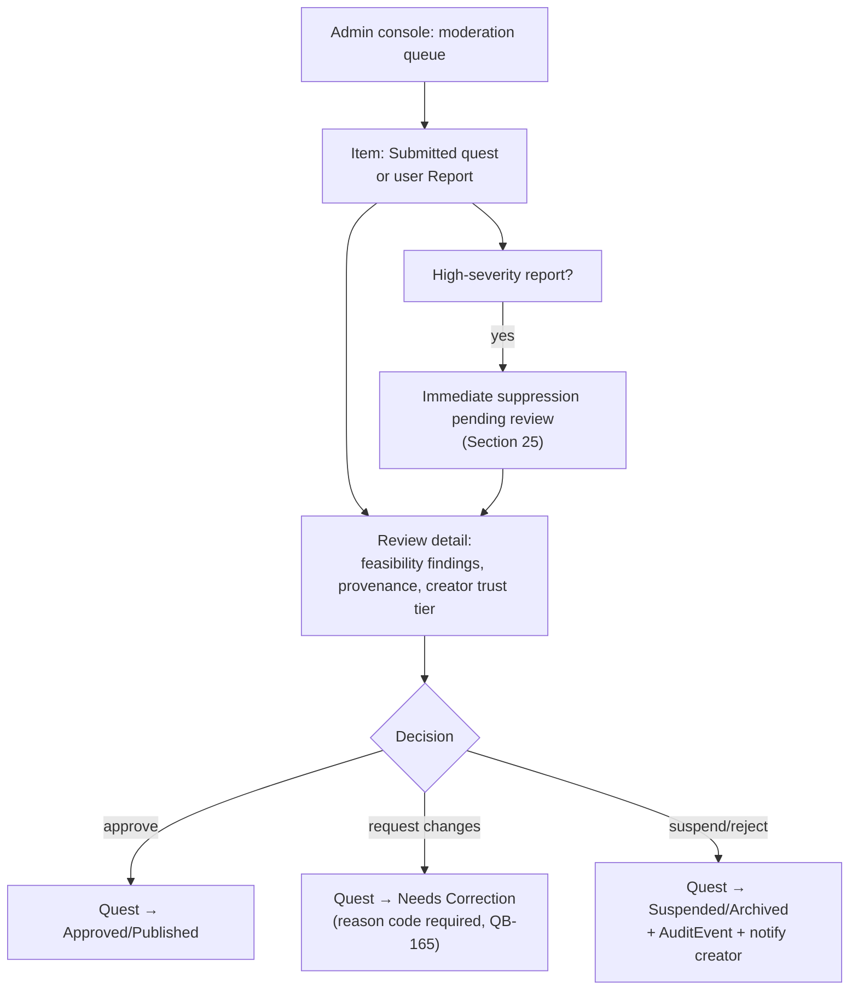

# Gate 1 — Wireflows and Screen/State Inventory

## Screen inventory (Section 46, traced as QB-301)

Grouped by primary nav section (Section 7) plus cross-cutting/admin screens.

**Home / The Board** — Welcome/onboarding + permission education, Guest/
personalized home board, Notifications.

**Map / The Realm** — Map/list explorer, Search and filter sheet, Region/fog
progress (R1.1).

**Quest lifecycle (reachable from Board, Map, or Forge)** — Quest detail +
spoiler preview, Start/preflight checklist, Active quest/navigation/
checkpoints, Pause/abandon/complete + evidence, Completion summary/rating.

**Forge** — Conversational guide, Structured Forge editor + version history,
Submission/moderation status.

**Hearth** — Hearth generator and inventory.

**Profile / Chronicle** — Chronicle/profile/progression, Saved collections
and campaigns, Party creation/invitation/progress, Privacy/accessibility/age/
theme/permissions settings, Creator/business/organization pages (Release 2,
stub only in R1).

**Admin** — Moderation/report/incident/readiness dashboards.

Every screen above needs the full state set from Section 42 (loading, empty,
error, partial-data, offline, permission-denied, age-blocked, location-
unavailable, no-results, provider-degraded, stale-data) — QB-280. The flows
below call out the specific states that matter most per screen rather than
repeating the full list each time.

## Flow 1: First open → first quest start (guest)

## Flow 2: Quest Forge — idea to submission

## Flow 3: Party invite and shared quest

## Flow 4: Moderation queue (admin/moderator)

## Cross-cutting UI rule

Every quest card and map pin (Section 45) surfaces: title + one-line summary,
tier + key factor labels, time/cost/distance/open-state, tags, accessibility/
adult/safety indicators where material, origin/trust/confidence badge,
save/start action, and sponsor disclosure when applicable. This card spec is
shared across the Home feed, Map, Search results, and the accessible list
view — one component, not four near-duplicates, so a11y and trust-badge
correctness only has to be verified once.
